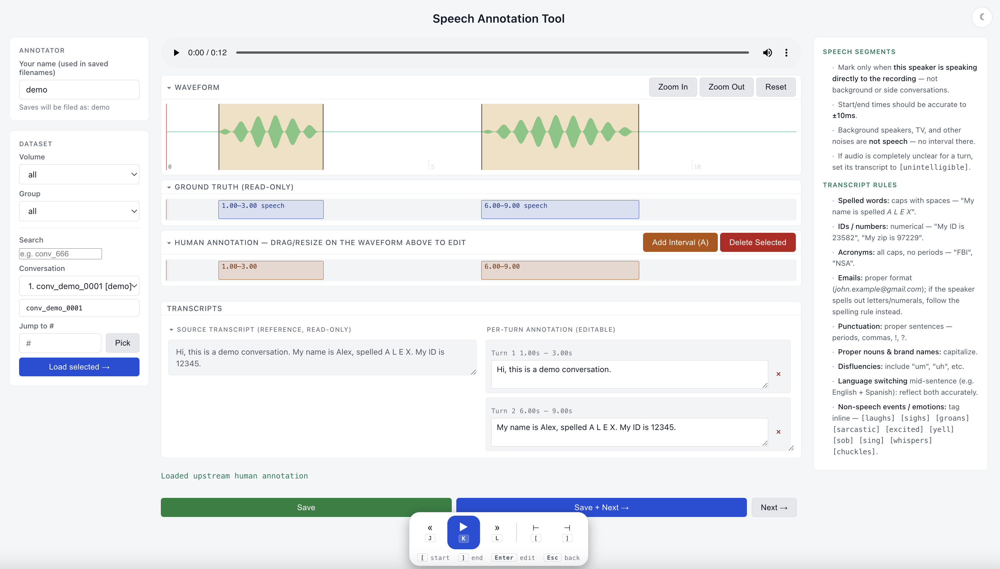

# nimbus-annotate

An open-source web UI for annotating conversation audio.



A worker opens the page with `?annotator=<name>`, listens to each conversation's
audio, and edits per-turn `{start, end, transcript}` segments. Conversations are
pulled from an **input connector** and saved to an **output connector**.

## Try it (no backend needed)

```bash
bun install
ANNOTATE_INPUT=demo bun run dev   # then open http://localhost:3000/?annotator=demo
```

Demo mode serves one synthetic conversation with generated audio — no Modal and
no config required. Great for exploring the UI. For real data, see
**Configuration** below.

## Stack

- [Bun](https://bun.sh) runtime
- [Hono](https://hono.dev) HTTP server
- `googleapis` for Google Drive output

## Run

```bash
bun install
cp .env.example .env   # then fill in values
bun run dev            # http://localhost:3000/?annotator=niel
```

`bun run start` for production (no watch).

## Configuration

All config is via environment variables — see `.env.example`.

| Connector | Env | Notes |
|-----------|-----|-------|
| Input | `ANNOTATE_INPUT=demo` | Built-in synthetic conversation + generated audio. No backend or config. |
| Input | `ANNOTATE_INPUT=modal` | Pulls conversations from the upstream Modal FastAPI service. Set `ANNOTATE_MODAL_BASE_URL` and `ANNOTATE_MODAL_COOKIE`. |
| Output | `ANNOTATE_OUTPUT=gdrive` | Saves annotation JSON to Google Drive (`ANNOTATE_GDRIVE_FOLDER_ID`). Use `local` to write to `ANNOTATE_OUTPUT_DIR` instead. |

### Google Drive auth

Easiest path — OAuth refresh token:

```bash
# fill ANNOTATE_GDRIVE_OAUTH_CLIENT_ID / _SECRET first
bun run oauth-setup     # opens a browser, prints a refresh token
```

Put the printed token in `ANNOTATE_GDRIVE_OAUTH_REFRESH_TOKEN`. Alternatively use
a service account via `GOOGLE_CREDENTIALS_JSON` or `GOOGLE_APPLICATION_CREDENTIALS`.

## Layout

```
src/
  server.ts          standalone Bun entry (serves at /)
  app.ts             Hono app factory + REST API + static serving
  connectors/        input (demo/modal) and output (gdrive/local) connectors
  oauth-setup.ts     one-off helper to mint a Drive OAuth refresh token
  public/index.html  the annotation UI (single page)
```

## API

- `GET  /api/conversations?annotator=…` — list conversations + annotation status
- `GET  /api/conversation/:id?volume=…` — one conversation + existing annotation
- `GET  /api/audio/:id?volume=…` — same-origin audio proxy (range-aware)
- `PUT  /api/annotation/:id` — save `[{start, end, transcript}]`
